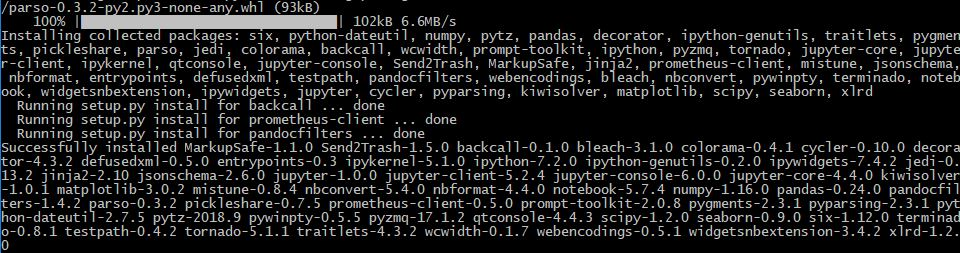

# Prezentace

Sem budeme dávat odkazy na prezentace z kurzu.

# Cheat sheety

- [Pandas](https://github.com/pandas-dev/pandas/blob/master/doc/cheatsheet/Pandas_Cheat_Sheet.pdf)
- [Soubor cheat sheetů od DataCamp](http://www.utc.fr/~jlaforet/Suppl/python-cheatsheets.pdf)


# Instalace

Pro tento kurz si potřebujete nainstalovat

- Python 3
- Pandas (pro zpracování dat)
- Jupyter Notebook (tam si budeme zkoušet kód)
- Requests (stahuje stránky)
- BeautifulSoup (vyhledává ve stránce)
- Scrapy (nástroj pro pokročilejší procházení více stránek webu)

## Kroky

### 1.

Nainstalujte Python **3**. Můžete použít [návod z kurzu vizualizace](https://sedlakovi.github.io/data-storytelling/#instalace) nebo třeba
[materiály od PyLadies](https://naucse.python.cz/course/pyladies/beginners/install/).

**Důležité** - pokud máte v uživatelském jménu do Windows mezery nebo např. háčky, čárky, zvolte "Customize installation" a vyberte cestu, která nebude uvnitř "C:\Users\Vaše jméno". Jinak můžete mít problém v pozdějších krocích s instalací balíčků.

Pozn.: Na Linuxu budete potřebovat ještě zvlášť nainstalovat `pip`. V Ubuntu pomocí
`sudo apt install python3-pip`.

### 2.

V terminálu spusťte:

    pip3 install --upgrade pandas jupyter beautifulsoup4 requests scrapy

_Tip: Na Windows se do terminálu kopíruje pravým tlačítkem myši._

Instalace by měla skončit se slovy `Successfully installed`, po kterých následuje výpis hromady balíčků s verzemi.



_Pozn.: Na obrázku je výstup z instalace jiných balíčků. Váš výstup by měl vypadat podobně._

Pokud instalace končí jinak, pravděpodobně v systému něco chybí a je potřeba to
doinstalovat.

### 3.

Nyní zkontrolujte instalaci.

## Kontrola instalace

### 1.

Stáhněte si [testovací skript](webscraping-kontrola.py) (klikněte pravým tlačítkem a "uložit
odkaz jako...").

### 2.

Na Windows můžete zkusit skript spustit dvojklikem. Měl by zůstat otevřený terminál.

Jestli nefunguje spuštění dvojklikem, spusťte skript z příkazové řádky. Například jestli se skript
stáhnul do `Downloads`, spustíte:

```
# Windows
py -3 Downloads\webscraping-kontrola.py

# MacOs, Linux
python3 Downloads/webscraping-kontrola.py
```

Pokud vidíte tabulku a heslo kurzu, instalaci jste provedli úspěšně, gratulujeme!
